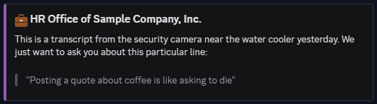

  

<ul>

<h1 align="center">EnduraBot</h1></summay>
</ul>

## About
**EnduraBot** is an open source Discord bot primarily made for the Endurance Coalition community.

The aim is three-fold:

1. Automate tedious, or difficult-to-manage, activities.
2. Create memories through entertaining moments.
3. Provide niche and useful utilities.

## Features
*The below list is not exhaustive.*

- Command `/rquote`: Take messages sent in a channel and present them in fictional scenarios for comedic effect.
- Command `/game`: Fuzzy search a game name and get back identity and price information, powered by the [IsThereAnyDeal](https://isthereanydeal.com/) API.
- Monitor incoming accounts by Discord ID and either just send an alert or also ban the incoming account.
- On account join see which invite was used by the account, who made the invite, and when the invite itself was created.

... and more.

  
   
  <i>Example output of <code>/rquote</code>.</i>

## Documentation
EnduraBot's documentation is hosted externally and powered by [Zensical](https://zensical.org). It can be navigated to by [clicking me](https://endurabot.edcgaming.org).

The documentation includes:

- Guide to host the bot locally.
- Guide on how to contribute.
- Explanation of bot's configuration and code organization (i.e architecture).
- Breakdown of custom classes and used API responses.

... and more.
