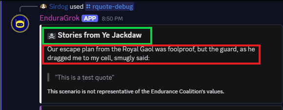

# Random Quote (/rquote) Breakdown

`/rquote` is a command that takes quotes from a configured channel and presents it in fictional situations for comedic effect.

## Theme creation
A *theme* refers to the fictional scenarios available for EnduraBot to select from. One might be a member of HR expressing concern during a 1-on-1, while another might be aliens freaking out over how weird humans are.

Prior to `2.0` themes were hard coded at `cogs/rquote.py`. Now, themes can be made by editing EnduraBot's configuration files.

The creation of a theme is a combination of *setting the embed configuration at [`data/variables.json`](configuration.md#variables)* and *setting the dialogue at [`data/misc_text.json`](configuration.md#miscellaneous-text)*.

### Embed configuration
The following is one of the default themes that ships with EnduraBot, held under the `rquote_themes` JSON object:
```json title="variables_example.json"
"hr": {
    "title": ":briefcase: HR Office of EDC, Inc.",
    "color": 10181046,
    "opener_key": "ooc_hr"
}
```

`hr` is an arbitrary name for the theme. This can be set to anything without consequence.

`title` is the raw title that the embed should use when the theme is chosen. It will always use this specific title.

`color` is the *integer form* of the color the embed should use. This can be easily Googled for any given color. This is *not* the same as the RGB or HEX form of a color.

`opener_key` is a special name that can also be anything. It is used at `misc_text.json` to match dialogue options to the theme. The convention I have done is to prepend `ooc_` to the arbitrary name, but it is not required.

There are no limits to the number of themes that can be added. Themes are chosen randomly.

### Dialogue

/// caption
A screenshot of `/rquote` with the embed `title` highlighted by the green box and a randomly selected dialogue option highlighted in the red box.
///

The dialogue used by `/rquote` is set at `misc_text.json`.

The following is the available dialogue that ships with EnduraBot's default `hr` theme.
```json title="misc_text_example.json"
    "ooc_hr": [
        "Thank you for coming in. I know this was sudden, but we've heard rumors that you said something... odd. Quote:",
        "So, regarding your contribution to the Q&A at the all-hands meeting, specifically when you took the mic and announced:"
    ]
```

When `/rquote` is run a theme is chosen at random amongst the themes set forth at `variables.json`. It then uses the `opener_key` found in the selected theme's data and matches it to the name of a list of strings at `misc_text.json`, in this case being `ooc_hr`. As previously explained, this matches dialogue options to a given theme, avoiding dialogue mismatching.

The green box above is the `title` set at `variables.json`. The red box is a selected dialogue option as demonstrated in the above code-block.

There are no limits to the amount of dialogue that can exist per theme. Dialogue, like themes, are chosen randomly.

## Logic breakdown
Below is an abbreviated breakdown of how `/rquote` works programmatically.

```py title="rquote.py"
# --- COMMAND: /rquote ---

@app_commands.command(name="rquote", description="Take an out of context quote and give it the wrong context.")
@app_commands.check(check_permissions)
@app_commands.guilds(GUILD_ID)
@app_commands.checks.dynamic_cooldown(custom_cooldown)

async def rquote(self, interaction: discord.Interaction):
```
`#!python @app_commands.check(check_permissions)` runs a custom function defined at `utils/permissions_checker.py` to ensure a person using the command is allowed to do so. This is added to *every* command in EnduraBot.

`#!python @app_commands.checks.dynamic_cooldown(custom_cooldown)` runs a custom function defined in `rquote.py` that determines if a member using the command should be cooled down or not.

Moving on: the bot checks to ensure a quote is not generated inside of the channel quotes are picked from. This is simply a preference chosen at time of development; this ocurring would not cause `/rquote` to break.

```py title="rquote.py"
if interaction.channel.id == ooc_channel_id:
    await interaction.response.send_message("You may not generate quotes in the channel quotes come from.", ephemeral=True)
    logger.log(UNAUTHORIZED, f"{interaction.user.name} ({interaction.user.id}) attempted to generate a quote in #{interaction.channel.name}.")
    return
```

Now, the command begins to do date calculations. This is because running a function to pick a message at random (such as `#!python random.choice()`) on an *entire channel* is ill-advised; especially if it has a lot of messages. For a couple hundred messages it *might* be okay, but once it hits 1,000 or more, putting *all* of them into memory would cause problems.

To get around this, rather than running `#!python random.choice()` on the entire channel, a random date between *now* and *a pre-defined date in the past* will be selected. We'll then pick a quote sometime *around* this date. This allows EnduraBot to scour a functionally unlimited number of messages while remaining efficient.

```py title="rquote.py"
#Current date - date roughly close to the first quote in #out-of-context
num_days = datetime.now(timezone.utc) - datetime(2022, 3, 14, 0, 0, 0, tzinfo=timezone.utc)

# This selects the random date.
random_date = datetime.now(timezone.utc) - timedelta(days=random.randint(1, num_days.days))
```
Once the date is generated a random pool of 75 messages will be pulled from *around* it. These messages are placed into table `msg_table`.

As `msg_table` populates it dynamically runs a regular expression filter to ensure that each processed message has text surrounded by `""`, otherwise the message is discarded. After that, an instance of class [`RquoteUsed`](rquote-used-handler-class.md) is used to ensure the message hasn't been used recently. If so, the message is discarded.

```py title="rquote.py"
msg_table = [
    msg async for msg in ooc_channel.history(limit=75, around=random_date)
    if not msg.author.bot
    and ( 
        (msg.content and (
            re.search(r'''["](.+?)["]''', msg.content)
        ))
    )
    and (
        dupe_blocker.check_status(f"{msg.id}") == False
    )
]
```

Once `msg_table` is populated with eligible messages EnduraBot will *then* make the random selection. This selection is then added to the recently used quotes table to ensure it isn't used again in the near future.

```py title="rquote.py"
selected_msg = random.choice(msg_table)

dupe_blocker.add_msg(f"{selected_msg.id}")
```
Now, to allow anonymity (and thus allow this command to be ran by users who cannot see the channel quotes are sourced from), the bot needs to strip anything in the message that is not surrounded by `""`.

This works because the format used by messages in EnduraBot's production server is to have a quote in `""` followed by a mention to the member who said it. This format has been enforced for years. EnduraBot would have a much harder time were this not the case.

```py title="rquote.py"
all_matches = re.findall(r'''["](.+?)["]''', selected_msg.content)
extracted_quote = '"\n"'.join(match.strip() for match in all_matches)
formatted_quote = f'"{extracted_quote}"'
```

The bot then picks a random theme, gets the theme's appropriate dialogue options, and then picks one of the dialogue options at random.
```py title="rquote.py"
# Select a random theme and appropriate opening text
selected_theme_data = self.themes[random.choice(list(self.themes.keys()))]
opener_key_from_json = selected_theme_data["opener_key"]
random_opener = random.choice(self.misc_data[opener_key_from_json])
```

The embed is then constructed.
```py title="rquote.py"
embed = discord.Embed(
        title=selected_theme_data["title"],
        description=f"{random_opener}\n\n>>> {formatted_quote}",
        color=selected_theme_data["color"]
        )

embed.set_footer(text="This scenario is not representative of the Endurance Coalition's values.")
```

If the selected message had an *attachment*, the bot will display the *first* attachment as the embed's image.
```py title="rquote.py"
if selected_msg.attachments:
    has_attachment = True
    embed.set_image(url=selected_msg.attachments[0].url)
```

Then, the embed is sent, and the action is logged.
```py title="rquote.py"
await interaction.response.send_message(embed=embed)
        logger.info(f"{interaction.user.name} ({interaction.user.id}) generated a random quote in #{interaction.channel.name} ({interaction.channel.id}).")
        logger.debug(f"{interaction.user.name} ({interaction.user.id}) generated a random quote. Channel: [#{interaction.channel.name} ({interaction.channel.id})]. Dated: [{selected_msg.created_at.strftime("%B %d, %Y")}]. Theme: [{selected_theme_data["title"]}]. Opener: [{random_opener}]. Content: [{formatted_quote}]. Attachment: [{has_attachment}].")
```